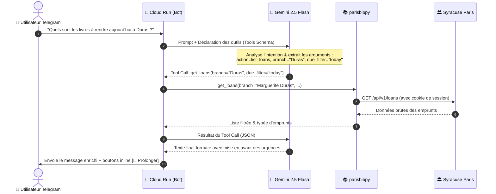
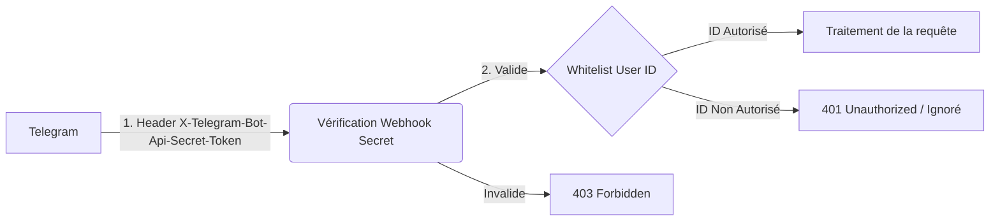

# 🏛️ Architecture Technique — BiblioBot Paris

> **Document de référence** : Architecture logicielle, infrastructure Google Cloud Platform (GCP), sécurité et intégration IA pour l'assistant Telegram des bibliothèques de Paris.

---

## 1. Vue d'Ensemble du Système

BiblioBot est une application conteneurisée **serverless** déployée sur **Google Cloud Run**. Elle opère selon une architecture **événementielle par Webhook** garantissant une latence minimale, une haute disponibilité et un coût de fonctionnement nul (**$0.00 / mois** sur le Free Tier GCP).

```mermaid
flowchart TD
    subgraph "Clients"
        TelApp["📱 Application Telegram (Mobile / Desktop)"]
    end

    subgraph "Telegram Cloud"
        TelAPI["⚡ Telegram Bot API"]
    end

    subgraph "Google Cloud Platform (GCP)"
        subgraph "Ingress & Compute"
            CR["🚀 Google Cloud Run (Container Python 3.11)\n- FastAPI Webhook Receiver\n- Dispatcher python-telegram-bot v21+"]
        end

        subgraph "Intelligence & LLM"
            Gemini["🧠 Google Gemini API (2.5 Flash)\n- Tool / Function Calling\n- Synthèse de réponses conviviales"]
        end

        subgraph "Stockage & Sécurité"
            SM["🔐 Secret Manager\n- Bot Token Telegram\n- Clé API Gemini\n- Identifiants Syracuse"]
            GCS["🪣 Cloud Storage (GCS)\n- Cache cookies de session Syracuse\n- Cache métadonnées couvertures"]
        end

        subgraph "Automatisation"
            CS["⏰ Cloud Scheduler\n- Cron quotidien 08:30 (Rappels push)"]
        end
    end

    subgraph "Services Externes"
        Syracuse["📚 Portail Bibliothèques de Paris (Syracuse)\nbibliotheques.paris.fr"]
        parisbibpy["📦 parisbibpy (SDK Métier)"]
    end

    TelApp <-->|HTTPS| TelAPI
    TelAPI -->|POST /webhook\n(Header secret_token)| CR
    CS -->|POST /cron/daily-check\n(OIDC Auth)| CR
    CR -->|Chargement des secrets| SM
    CR <-->|Lecture / Sauvegarde sessions| GCS
    CR <-->|Function Calling (JSON)| Gemini
    CR --> parisbibpy
    parisbibpy <-->|HTTPS / REST| Syracuse
    CR -->|Envoi messages & médias| TelAPI
```

---

## 2. Composants Clés & Choix Technologiques

### 2.1 Moteur Webhook & Bot Framework : `python-telegram-bot` v21+ & `FastAPI`
- **Choix du mode Webhook** : Contrairement au polling (`getUpdates`) qui nécessite un conteneur allumé en continu, le mode Webhook permet à Cloud Run d'être invoqué uniquement à l'arrivée d'un message (`scale to zero` si inactif).
- **Framework** :
  - **`FastAPI`** : Micro-serveur ASGI ultra-léger servant d'écouteur HTTP pour Telegram (`/webhook`) et pour les tâches planifiées (`/cron/daily-check`).
  - **`python-telegram-bot` v21+ (asyncio)** : Prise en charge des types Telegram (Keyboards, MediaGroups, Parse Modes), routage des commandes, et gestion fluide des callbacks de boutons.

### 2.2 Orchestration IA : Google Gemini avec Function Calling
L'IA n'est pas un simple chatbot textuel, elle pilote le système via le mécanisme de **Function Calling (Tools)** :



#### Définition des Outils exposés à Gemini :
1. `get_loans(user_name=None, branch_name=None, due_within_days=None)` : Récupère les prêts actifs selon critères.
2. `renew_single_loan(loan_id=..., title=...)` : Prolonge un prêt spécifique.
3. `renew_expiring_loans(within_days=3)` : Prolonge en lot tous les prêts expirant dans la fenêtre demandée.
4. `get_branches_summary()` : Renvoie le récapitulatif par bibliothèque (Trip Planner).
5. `get_book_covers(loan_ids=[...])` : Récupère les liens d'images des couvertures.

---

### 2.3 Couche Métier : `parisbibpy` & Gestion Stateful de Session
Le portail Syracuse de la Ville de Paris repose sur des cookies de session. Pour garantir des temps de réponse sous les 2 secondes :
- **Pattern "Stateless Compute, Stateful Session"** :
  1. À chaque requête, le bot charge le cookie de session Syracuse depuis **Google Cloud Storage (GCS)** ou la mémoire vive.
  2. Si la session est valide, `parisbibpy` exécute immédiatement l'opération (lecture des prêts, prolongation).
  3. Si la session a expiré (HTTP 401 ou redirection login), `parisbibpy` se ré-authentifie automatiquement avec les identifiants stockés dans **Secret Manager**, et met à jour le fichier de session sur GCS.
- **Support Multi-Comptes Natif** : Grâce aux fonctionnalités de `parisbibpy` (Layer 2 Family Coordinator), toutes les cartes rattachées (`UserPairings`) sont inspectées et indexées automatiquement.

---

### 2.4 Notifications Proactives (Push) via Cloud Scheduler
- Un déclencheur **Cloud Scheduler** est configuré avec l'expression cron : `30 8 * * *` (08h30 chaque matin, fuseau `Europe/Paris`).
- Il émet une requête HTTP `POST` sécurisée par un jeton **OIDC** vers l'endpoint `/cron/daily-check` de Cloud Run.
- Le service vérifie les prêts : si des livres expirent à J, J+1 ou J+2, une notification Telegram prioritaire est envoyée directement dans le chat de la famille.

---

## 3. Sécurité & Protection des Données



1. **Vérification du Secret Token Webhook** :
   Telegram transmet le header `X-Telegram-Bot-Api-Secret-Token`. L'endpoint `/webhook` rejette immédiatement toute requête non munie de la clé secrète configurée lors du `setWebhook`.
2. **Whitelist Stricte des Utilisateurs Telegram (`ALLOWED_TELEGRAM_USER_IDS`)** :
   Le bot est strictement privé. Toute interaction venant d'un `user_id` inconnu est rejetée et loguée sans révéler aucune information.
3. **Gestion Zéro-Secret dans le Code** :
   Aucun token, mot de passe ou clé n'est présent dans le dépôt Git. Les variables sensibles sont injectées via **GCP Secret Manager** :
   - `TELEGRAM_BOT_TOKEN`
   - `TELEGRAM_WEBHOOK_SECRET`
   - `GEMINI_API_KEY`
   - `PARISBIB_USERNAME` / `PARISBIB_PASSWORD`
   - `ALLOWED_TELEGRAM_USER_IDS`

---

## 4. Structure Recommandée du Répertoire

```text
telegram-bib-bot/
├── .env.example                 # Modèle des variables d'environnement
├── .gitignore
├── Dockerfile                   # Image python:3.11-slim optimisée
├── README.md                    # Guide de démarrage et documentation
├── pyproject.toml / requirements.txt
├── scripts/
│   ├── set_webhook.py           # Script d'enregistrement du Webhook Telegram
│   └── deploy_gcp.sh            # Script de déploiement Cloud Run & Scheduler
├── src/
│   ├── __init__.py
│   ├── config.py                # Configuration typée (Pydantic / Dataclass)
│   ├── main.py                  # Entrée FastAPI & cycle de vie de l'application
│   ├── bot/
│   │   ├── __init__.py
│   │   ├── dispatcher.py        # Routeur des messages et callbacks Telegram
│   │   ├── handlers.py          # Gestionnaires des commandes (/start, /emprunts)
│   │   ├── keyboards.py         # Générateurs des claviers Inline interactifs
│   │   └── formatters.py        # Mise en forme HTML Telegram (badges, listes)
│   ├── ai/
│   │   ├── __init__.py
│   │   ├── gemini_agent.py      # Client Gemini 2.5 Flash avec Function Calling
│   │   └── tools_schema.py      # Schémas OpenAPI / Pydantic des fonctions exposées
│   ├── services/
│   │   ├── __init__.py
│   │   ├── bib_service.py       # Wrapper métier autour de parisbibpy
│   │   ├── session_store.py     # Gestionnaire de persistance des cookies (GCS/Local)
│   │   └── notifier.py          # Moteur des alertes quotidiennes proactives
│   └── cron/
│       ├── __init__.py
│       └── daily_checker.py     # Tâche planifiée matinale
└── tests/
    ├── test_gemini_tools.py
    └── test_bib_service.py
```

---

## 5. Déploiement & Industrialisation GCP

### 5.1 Ressources GCP Requises (100% éligibles Free Tier)
- **Cloud Run** : 1 service conteneurisé (512 MiB RAM, 1 vCPU, min-instances: 0, max-instances: 2).
- **Google Cloud Storage (GCS)** : 1 bucket privé (`<project-id>-bibbot-state`) pour la persistance des sessions.
- **Secret Manager** : 5 secrets gérés avec chiffrement automatique.
- **Cloud Scheduler** : 1 job HTTP périodique.

### 5.2 Commande de Déploiement Type (`gcloud`)
```bash
# 1. Build et déploiement du conteneur sur Cloud Run
gcloud run deploy biblio-bot \
    --source . \
    --region europe-west9 \
    --platform managed \
    --allow-unauthenticated \
    --memory 512Mi \
    --cpu 1 \
    --min-instances 0 \
    --max-instances 2 \
    --set-secrets "TELEGRAM_BOT_TOKEN=TELEGRAM_BOT_TOKEN:latest,GEMINI_API_KEY=GEMINI_API_KEY:latest,PARISBIB_USERNAME=PARISBIB_USERNAME:latest,PARISBIB_PASSWORD=PARISBIB_PASSWORD:latest,WEBHOOK_SECRET=TELEGRAM_WEBHOOK_SECRET:latest" \
    --set-env-vars "GCS_BUCKET_NAME=mon-projet-bibbot-state,ALLOWED_USER_IDS=12345678,87654321"

# 2. Configuration du Webhook Telegram
curl -X POST "https://api.telegram.org/bot<TOKEN>/setWebhook" \
     -H "Content-Type: application/json" \
     -d '{
       "url": "https://biblio-bot-xxxxxx.a.run.app/webhook",
       "secret_token": "<VOTRE_WEBHOOK_SECRET>",
       "drop_pending_updates": true
     }'

# 3. Création du déclencheur Cloud Scheduler pour les alertes du matin
gcloud scheduler jobs create http biblio-bot-daily-reminder \
    --location europe-west9 \
    --schedule "30 8 * * *" \
    --time-zone "Europe/Paris" \
    --uri "https://biblio-bot-xxxxxx.a.run.app/cron/daily-check" \
    --http-method POST \
    --oidc-service-account-email "cloud-run-invoker@<PROJECT_ID>.iam.gserviceaccount.com"
```

---

## 6. Synthèse des Points Forts de l'Architecture

1. **Économique ($0.00)** : Aucune machine virtuelle allumée H24. Le serveur ne s'éveille que lorsqu'un message Telegram arrive ou lors du cron du matin.
2. **Performant** : Moins de 2s grâce au maintien de la session Syracuse sur GCS et à la rapidité de Gemini 2.5 Flash.
3. **Extensible** : L'ajout de nouvelles fonctionnalités (réservation d'ouvrages, recherche dans le catalogue de la Ville de Paris) se fait simplement en ajoutant une fonction Python et sa déclaration Tool à Gemini.
