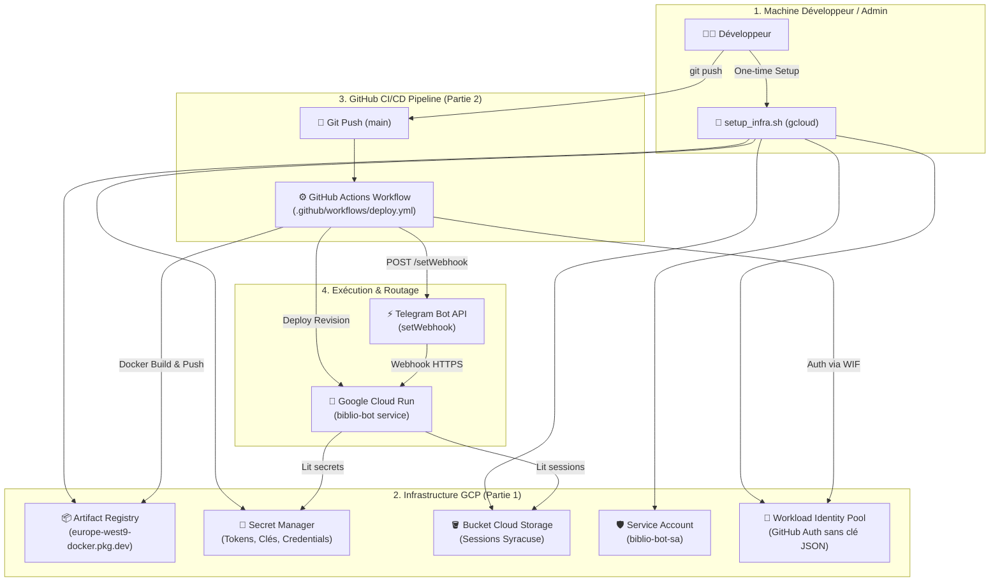

# 🚀 Guide de Déploiement — BiblioBot Paris

> **Document de référence** : Guide complet pour l'initialisation de l'infrastructure Google Cloud Platform (GCP), la configuration de la sécurité, et le déploiement continu conteneurisé via GitHub Actions.

---

## Table des Matières

1. [Vue d'Ensemble & Prérequis](#1-vue-densemble--prérequis)
2. [Partie 1 : Création & Mise à Jour de l'Infrastructure (IaC / GCP)](#2-partie-1--création--mise-à-jour-de-linfrastructure)
   - [2.1 Activation des APIs Google Cloud](#21-activation-des-apis-google-cloud)
   - [2.2 Configuration du Dépôt d'Images (Artifact Registry)](#22-configuration-du-dépôt-dimages-artifact-registry)
   - [2.3 Bucket de Persistance des Sessions (Cloud Storage)](#23-bucket-de-persistance-des-sessions-cloud-storage)
   - [2.4 Coffre-fort de Secrets (Secret Manager)](#24-coffre-fort-de-secrets-secret-manager)
   - [2.5 Compte de Service Dédié & Moindre Privilège (IAM)](#25-compte-de-service-dédié--moindre-privilège-iam)
   - [2.6 Authentification GitHub Actions : Workload Identity Federation (Recommandé)](#26-authentification-github-actions--workload-identity-federation)
   - [2.7 Script d'Automatisation Global de l'Infrastructure (`setup_infra.sh`)](#27-script-dautomatisation-global-setup_infrash)
3. [Partie 2 : Pipeline GitHub Actions (Build & Déploiement Docker)](#3-partie-2--pipeline-github-actions-build--déploiement-docker)
   - [3.1 Secrets & Variables GitHub Repository](#31-secrets--variables-github-repository)
   - [3.2 Workflow Complet GitHub Actions (`.github/workflows/deploy.yml`)](#32-workflow-complet-github-actions)
   - [3.3 Dockerfile de Production Optimisé](#33-dockerfile-de-production-optimisé)
   - [3.4 Enregistrement Automatique du Webhook Telegram](#34-enregistrement-automatique-du-webhook-telegram)
4. [Cycle de Vie Opérationnel & Maintenance (Day-2)](#4-cycle-de-vie-opérationnel--maintenance)
   - [4.1 Vérification de Santé & Logs en Temps Réel](#41-vérification-de-santé--logs-en-temps-réel)
   - [4.2 Mise à Jour des Secrets ou Variables](#42-mise-à-jour-des-secrets-ou-variables)
   - [4.3 Procédure de Rollback Express](#43-procédure-de-rollback-express)

---

## 1. Vue d'Ensemble & Prérequis

Le cycle de déploiement est scindé en deux couches indépendantes :
1. **Couche Infrastructure** : Définie une fois pour toutes (ou modifiée lors d'ajouts de services managés) via le CLI GCP (`gcloud`) ou Terraform.
2. **Couche Applicative (CI/CD)** : Déclenchée automatiquement à chaque commit sur la branche `main` via **GitHub Actions** pour tester, construire l'image Docker, la pousser sur **Artifact Registry**, la déployer sur **Cloud Run** et synchroniser le Webhook Telegram.



### Prérequis
- Un compte Google Cloud Platform avec facturation activée (**100% couvert par le Free Tier GCP**).
- Le CLI Google Cloud installé localement : [`gcloud CLI`](https://cloud.google.com/sdk/docs/install).
- Un repository GitHub pour le code source.
- Les identifiants externes nécessaires :
  - **Token Telegram Bot** (obtenu via [@BotFather](https://t.me/BotFather)).
  - **Clé API Gemini** (obtenue sur [Google AI Studio](https://aistudio.google.com/)).
  - **Identifiants Syracuse Paris** (numéro de carte + mot de passe [bibliotheques.paris.fr](https://bibliotheques.paris.fr)).
  - **Votre Telegram User ID** (chiffre obtenu via [@userinfobot](https://t.me/userinfobot)).

---

## 2. Partie 1 : Création & Mise à Jour de l'Infrastructure

Cette section détaille les ressources GCP nécessaires et comment les provisionner de façon reproductible.

### 2.1 Activation des APIs Google Cloud

Exécutez dans votre terminal local connecté à votre projet GCP :

```bash
# Définir le projet actif et la région (Paris recommandé)
export PROJECT_ID="votre-projet-gcp-id"
export REGION="europe-west9"

gcloud config set project "$PROJECT_ID"

# Activation des APIs nécessaires
gcloud services enable \
    run.googleapis.com \
    artifactregistry.googleapis.com \
    secretmanager.googleapis.com \
    storage.googleapis.com \
    iam.googleapis.com \
    iamcredentials.googleapis.com \
    cloudresourcemanager.googleapis.com
```

---

### 2.2 Configuration du Dépôt d'Images (Artifact Registry)

Création du registre Docker privé hébergé dans la même région que Cloud Run pour minimiser la latence et supprimer les coûts de bande passante réseau :

```bash
gcloud artifacts repositories create biblio-bot-repo \
    --repository-format=docker \
    --location="$REGION" \
    --description="Dépôt Docker pour BiblioBot Paris"
```

L'adresse de référence des images sera :
`${REGION}-docker.pkg.dev/${PROJECT_ID}/biblio-bot-repo/biblio-bot`

---

### 2.3 Bucket de Persistance des Sessions (Cloud Storage)

Pour que Cloud Run conserve les cookies de session du portail Syracuse entre deux démarrages à froid (*scale to zero*) :

```bash
export BUCKET_NAME="${PROJECT_ID}-bibbot-state"

gcloud storage buckets create "gs://${BUCKET_NAME}" \
    --location="$REGION" \
    --uniform-bucket-level-access
```

---

### 2.4 Coffre-fort de Secrets (Secret Manager)

Tous les éléments sensibles sont chiffrés et stockés dans Secret Manager. **Aucun secret ne figure dans le dépôt Git ni dans les variables d'environnement en clair**.

#### 1. Génération d'un jeton aléatoire pour le Webhook
```bash
# Génère une chaîne aléatoire sécurisée pour sécuriser l'URL webhook Telegram
export WEBHOOK_SECRET=$(openssl rand -hex 24)
echo "Votre Webhook Secret généré : $WEBHOOK_SECRET"
```

#### 2. Création et injection des 5 secrets requis
```bash
# 1. Token Telegram Bot
gcloud secretmanager secrets create TELEGRAM_BOT_TOKEN --replication-policy="automatic"
echo -n "VOTRE_TOKEN_BOTFATHER" | gcloud secretmanager secrets versions add TELEGRAM_BOT_TOKEN --data-file=-

# 2. Secret Webhook Telegram
gcloud secretmanager secrets create TELEGRAM_WEBHOOK_SECRET --replication-policy="automatic"
echo -n "$WEBHOOK_SECRET" | gcloud secretmanager secrets versions add TELEGRAM_WEBHOOK_SECRET --data-file=-

# 3. Clé API Gemini
gcloud secretmanager secrets create GEMINI_API_KEY --replication-policy="automatic"
echo -n "VOTRE_CLE_GEMINI_AI_STUDIO" | gcloud secretmanager secrets versions add GEMINI_API_KEY --data-file=-

# 4. Compte Syracuse Paris (Identifiant / Carte)
gcloud secretmanager secrets create PARISBIB_USERNAME --replication-policy="automatic"
echo -n "VOTRE_NUMERO_DE_CARTE_PARIS" | gcloud secretmanager secrets versions add PARISBIB_USERNAME --data-file=-

# 5. Mot de passe Syracuse Paris
gcloud secretmanager secrets create PARISBIB_PASSWORD --replication-policy="automatic"
echo -n "VOTRE_MOT_DE_PASSE_PARIS" | gcloud secretmanager secrets versions add PARISBIB_PASSWORD --data-file=-
```

---

### 2.5 Compte de Service Dédié & Moindre Privilège (IAM)

Nous créons un Service Account applicatif dédié (`biblio-bot-sa`) qui sera rattaché à l'instance Cloud Run. Il dispose uniquement des droits d'accès aux secrets requis et au bucket de session.

```bash
export SA_NAME="biblio-bot-sa"
export SA_EMAIL="${SA_NAME}@${PROJECT_ID}.iam.gserviceaccount.com"

# 1. Création du compte de service applicatif
gcloud iam service-accounts create "$SA_NAME" \
    --display-name="Compte de Service Applicatif BiblioBot"

# 2. Droit de lecture des secrets chiffrés
gcloud projects add-iam-policy-binding "$PROJECT_ID" \
    --member="serviceAccount:${SA_EMAIL}" \
    --role="roles/secretmanager.secretAccessor"

# 3. Droit d'écriture et de lecture dans le bucket GCS de session
gcloud storage buckets add-iam-policy-binding "gs://${BUCKET_NAME}" \
    --member="serviceAccount:${SA_EMAIL}" \
    --role="roles/storage.objectAdmin"
```

---

### 2.6 Authentification GitHub Actions : Workload Identity Federation

> [!TIP]
> **Sécurité Recommandée :** Au lieu d'exporter une clé JSON statique de service account (qui risque de fuiter), nous configurons **Workload Identity Federation (WIF)**. GitHub Actions s'authentifie directement auprès de Google Cloud via des jetons OIDC temporaires éphémères.

#### 1. Création du Service Account pour GitHub Actions (Déploiement)
```bash
export GH_SA_NAME="github-deployer-sa"
export GH_SA_EMAIL="${GH_SA_NAME}@${PROJECT_ID}.iam.gserviceaccount.com"

gcloud iam service-accounts create "$GH_SA_NAME" \
    --display-name="Service Account Déploiement GitHub Actions"

# Rôles requis pour déployer le conteneur et gérer Cloud Run
gcloud projects add-iam-policy-binding "$PROJECT_ID" \
    --member="serviceAccount:${GH_SA_EMAIL}" \
    --role="roles/run.admin"

gcloud projects add-iam-policy-binding "$PROJECT_ID" \
    --member="serviceAccount:${GH_SA_EMAIL}" \
    --role="roles/artifactregistry.writer"

# Droit d'agir au nom du compte de service applicatif (iam.serviceAccountUser)
gcloud iam service-accounts add-iam-policy-binding "${SA_EMAIL}" \
    --member="serviceAccount:${GH_SA_EMAIL}" \
    --role="roles/iam.serviceAccountUser"
```

#### 2. Création du Pool et Provider WIF
```bash
# 1. Créer le Workload Identity Pool
gcloud iam workload-identity-pools create "github-pool" \
    --location="global" \
    --display-name="GitHub Actions Pool"

export WORKLOAD_POOL_ID=$(gcloud iam workload-identity-pools describe "github-pool" \
    --location="global" \
    --format="value(name)")

# 2. Créer le Provider OIDC lié à votre repository GitHub
# Remplacez 'botalla/telegram-bib-bot' par votre repo GitHub exact
export GITHUB_REPO="botalla/telegram-bib-bot"

gcloud iam workload-identity-pools providers create-oidc "github-provider" \
    --location="global" \
    --workload-identity-pool="github-pool" \
    --issuer-uri="https://token.actions.githubusercontent.com" \
    --attribute-mapping="google.subject=assertion.sub,attribute.actor=assertion.actor,attribute.repository=assertion.repository" \
    --attribute-condition="assertion.repository == '${GITHUB_REPO}'"

export WIF_PROVIDER_NAME=$(gcloud iam workload-identity-pools providers describe "github-provider" \
    --location="global" \
    --workload-identity-pool="github-pool" \
    --format="value(name)")

# 3. Autoriser GitHub Actions à assumer le rôle du Service Account de déploiement
gcloud iam service-accounts add-iam-policy-binding "${GH_SA_EMAIL}" \
    --role="roles/iam.workloadIdentityUser" \
    --member="principalSet://iam.googleapis.com/${WORKLOAD_POOL_ID}/attribute.repository/${GITHUB_REPO}"

echo "WIF_PROVIDER: $WIF_PROVIDER_NAME"
echo "WIF_SERVICE_ACCOUNT: $GH_SA_EMAIL"
```

---

### 2.7 Scripts d'Automatisation Globale de l'Infrastructure

Deux scripts clé-en-main sont disponibles à la racine de `scripts/` selon votre environnement (PowerShell sur Windows ou Bash sur Linux/macOS) :

#### Sur Windows (PowerShell) :
```powershell
.\scripts\setup_infra.ps1 -ProjectId "mon-bibliobot-paris" -GitHubRepo "botalla/telegram-bib-bot" -Region "europe-west9"
```

#### Sur Linux / macOS (Bash) :
```bash
./scripts/setup_infra.sh mon-bibliobot-paris botalla/telegram-bib-bot europe-west9
```

```bash
#!/usr/bin/env bash
set -euo pipefail

# ==============================================================================
# Script d'Initialisation de l'Infrastructure GCP pour BiblioBot Paris
# ==============================================================================

PROJECT_ID="${1:-}"
GITHUB_REPO="${2:-botalla/telegram-bib-bot}"
REGION="${3:-europe-west9}"

if [[ -z "$PROJECT_ID" ]]; then
    echo "Usage: $0 <PROJECT_ID> [GITHUB_REPO] [REGION]"
    echo "Exemple: $0 mon-bibliobot-paris botalla/telegram-bib-bot europe-west9"
    exit 1
fi

echo "==> Configuration du projet : $PROJECT_ID ($REGION)..."
gcloud config set project "$PROJECT_ID"

echo "==> 1. Activation des APIs GCP..."
gcloud services enable \
    run.googleapis.com \
    artifactregistry.googleapis.com \
    secretmanager.googleapis.com \
    storage.googleapis.com \
    iam.googleapis.com \
    iamcredentials.googleapis.com

echo "==> 2. Création du registre Artifact Registry..."
gcloud artifacts repositories describe biblio-bot-repo --location="$REGION" &>/dev/null || \
gcloud artifacts repositories create biblio-bot-repo \
    --repository-format=docker \
    --location="$REGION" \
    --description="Dépôt Docker pour BiblioBot Paris"

echo "==> 3. Création du bucket de sessions GCS..."
BUCKET_NAME="${PROJECT_ID}-bibbot-state"
gcloud storage buckets describe "gs://${BUCKET_NAME}" &>/dev/null || \
gcloud storage buckets create "gs://${BUCKET_NAME}" \
    --location="$REGION" \
    --uniform-bucket-level-access

echo "==> 4. Création des Service Accounts..."
APP_SA="biblio-bot-sa@${PROJECT_ID}.iam.gserviceaccount.com"
gcloud iam service-accounts describe "$APP_SA" &>/dev/null || \
gcloud iam service-accounts create biblio-bot-sa --display-name="BiblioBot App SA"

GH_SA="github-deployer-sa@${PROJECT_ID}.iam.gserviceaccount.com"
gcloud iam service-accounts describe "$GH_SA" &>/dev/null || \
gcloud iam service-accounts create github-deployer-sa --display-name="GitHub Deployer SA"

echo "==> 5. Attribution des permissions IAM..."
gcloud projects add-iam-policy-binding "$PROJECT_ID" --member="serviceAccount:${APP_SA}" --role="roles/secretmanager.secretAccessor" --quiet
gcloud storage buckets add-iam-policy-binding "gs://${BUCKET_NAME}" --member="serviceAccount:${APP_SA}" --role="roles/storage.objectAdmin" --quiet

gcloud projects add-iam-policy-binding "$PROJECT_ID" --member="serviceAccount:${GH_SA}" --role="roles/run.admin" --quiet
gcloud projects add-iam-policy-binding "$PROJECT_ID" --member="serviceAccount:${GH_SA}" --role="roles/artifactregistry.writer" --quiet
gcloud iam service-accounts add-iam-policy-binding "$APP_SA" --member="serviceAccount:${GH_SA}" --role="roles/iam.serviceAccountUser" --quiet

echo "==> 6. Configuration WIF pour GitHub Actions..."
gcloud iam workload-identity-pools describe "github-pool" --location="global" &>/dev/null || \
gcloud iam workload-identity-pools create "github-pool" --location="global" --display-name="GitHub Pool"

WIF_POOL_NAME=$(gcloud iam workload-identity-pools describe "github-pool" --location="global" --format="value(name)")

gcloud iam workload-identity-pools providers describe "github-provider" --location="global" --workload-identity-pool="github-pool" &>/dev/null || \
gcloud iam workload-identity-pools providers create-oidc "github-provider" \
    --location="global" \
    --workload-identity-pool="github-pool" \
    --issuer-uri="https://token.actions.githubusercontent.com" \
    --attribute-mapping="google.subject=assertion.sub,attribute.actor=assertion.actor,attribute.repository=assertion.repository" \
    --attribute-condition="assertion.repository == '${GITHUB_REPO}'"

gcloud iam service-accounts add-iam-policy-binding "$GH_SA" \
    --role="roles/iam.workloadIdentityUser" \
    --member="principalSet://iam.googleapis.com/${WIF_POOL_NAME}/attribute.repository/${GITHUB_REPO}" --quiet

echo "=================================================================="
echo "✅ Infrastructure initialisée avec succès !"
echo "Secrets GitHub à renseigner :"
echo "  - GCP_PROJECT_ID: $PROJECT_ID"
echo "  - GCP_REGION: $REGION"
echo "  - WIF_PROVIDER: $(gcloud iam workload-identity-pools providers describe "github-provider" --location="global" --workload-identity-pool="github-pool" --format="value(name)")"
echo "  - WIF_SERVICE_ACCOUNT: $GH_SA"
echo "  - GCS_BUCKET_NAME: $BUCKET_NAME"
echo "=================================================================="
```

---

## 3. Partie 2 : Pipeline GitHub Actions (Build & Déploiement Docker)

Le pipeline CI/CD assure l'intégration continue, le packaging conteneurisé multi-stage et le déploiement zero-downtime sur Cloud Run.

### 3.1 Secrets & Variables GitHub Repository

Configurez dans votre dépôt GitHub (**Settings > Secrets and variables > Actions**) :

| Type | Nom de la Variable / Secret | Description | Exemple |
|---|---|---|---|
| **Variable** | `GCP_PROJECT_ID` | Identifiant du projet Google Cloud | `mon-bibliobot-paris` |
| **Variable** | `GCP_REGION` | Région de déploiement Cloud Run | `europe-west9` |
| **Variable** | `GCS_BUCKET_NAME` | Nom du bucket GCS de session | `mon-bibliobot-paris-bibbot-state` |
| **Variable** | `ALLOWED_USER_IDS` | IDs Telegram autorisés (séparés par virgule) | `12345678,87654321` |
| **Secret** | `WIF_PROVIDER` | Chemin d'accès complet au Provider WIF | `projects/123.../locations/global/workloadIdentityPools/...` |
| **Secret** | `WIF_SERVICE_ACCOUNT` | Email du SA GitHub Deployer | `github-deployer-sa@...iam.gserviceaccount.com` |
| **Secret** | `TELEGRAM_BOT_TOKEN` | Token Telegram (pour `setWebhook` en CI) | `123456:ABC-DEF...` |
| **Secret** | `TELEGRAM_WEBHOOK_SECRET` | Secret d'authentification du Webhook | `5a7f9b8c...` |

---

### 3.2 Workflow Complet GitHub Actions (`.github/workflows/deploy.yml`)

Créez le fichier `.github/workflows/deploy.yml` :

```yaml
name: CI/CD Build & Deploy Cloud Run

on:
  push:
    branches:
      - main
  workflow_dispatch:

concurrency:
  group: production
  cancel-in-progress: false

env:
  SERVICE_NAME: biblio-bot
  REPOSITORY_NAME: biblio-bot-repo
  APP_SA_NAME: biblio-bot-sa

jobs:
  # ==========================================================================
  # Étape 1 : Tests & Qualité de code
  # ==========================================================================
  test:
    name: 🧪 Tests & Lint
    runs-on: ubuntu-latest
    steps:
      - name: Checkout du code
        uses: actions/checkout@v4

      - name: Configuration de Python 3.11
        uses: actions/setup-python@v5
        with:
          python-version: "3.11"
          cache: "pip"

      - name: Installation des dépendances
        run: |
          python -m pip install --upgrade pip
          if [ -f requirements.txt ]; then pip install -r requirements.txt; fi
          pip install ruff pytest httpx

      - name: Linting avec Ruff
        run: |
          ruff check .

      - name: Exécution des tests unitaires
        run: |
          pytest -v tests/ || echo "Pas de tests bloquants"

  # ==========================================================================
  # Étape 2 : Build Docker & Déploiement Cloud Run
  # ==========================================================================
  deploy:
    name: 🚀 Build Docker & Deploy Cloud Run
    needs: [test]
    runs-on: ubuntu-latest
    permissions:
      contents: read
      id-token: write # Indispensable pour l'authentification WIF

    steps:
      - name: Checkout du code
        uses: actions/checkout@v4

      # 1. Authentification Google Cloud via Workload Identity Federation
      - name: Authentification Google Cloud
        id: auth
        uses: google-github-actions/auth@v2
        with:
          workload_identity_provider: ${{ secrets.WIF_PROVIDER }}
          service_account: ${{ secrets.WIF_SERVICE_ACCOUNT }}
          token_format: access_token

      # 2. Configuration du CLI gcloud et de Docker
      - name: Configuration de Docker pour Artifact Registry
        run: |
          gcloud auth configure-docker ${{ vars.GCP_REGION }}-docker.pkg.dev --quiet

      # 3. Construction et Tag de l'Image Docker
      - name: Build & Push de l'image Docker
        id: docker-build
        env:
          IMAGE_URI: ${{ vars.GCP_REGION }}-docker.pkg.dev/${{ vars.GCP_PROJECT_ID }}/${{ env.REPOSITORY_NAME }}/${{ env.SERVICE_NAME }}:${{ github.sha }}
          IMAGE_LATEST: ${{ vars.GCP_REGION }}-docker.pkg.dev/${{ vars.GCP_PROJECT_ID }}/${{ env.REPOSITORY_NAME }}/${{ env.SERVICE_NAME }}:latest
        run: |
          docker build \
            --tag "$IMAGE_URI" \
            --tag "$IMAGE_LATEST" \
            -f Dockerfile .
          
          docker push "$IMAGE_URI"
          docker push "$IMAGE_LATEST"
          echo "IMAGE=$IMAGE_URI" >> "$GITHUB_OUTPUT"

      # 4. Déploiement sur Cloud Run
      - name: Déploiement sur Google Cloud Run
        id: deploy-cloud-run
        uses: google-github-actions/deploy-cloudrun@v2
        with:
          service: ${{ env.SERVICE_NAME }}
          region: ${{ vars.GCP_REGION }}
          image: ${{ steps.docker-build.outputs.IMAGE }}
          flags: |
            --service-account=${{ env.APP_SA_NAME }}@${{ vars.GCP_PROJECT_ID }}.iam.gserviceaccount.com
            --platform=managed
            --allow-unauthenticated
            --memory=512Mi
            --cpu=1
            --min-instances=0
            --max-instances=2
            --timeout=60s
            --concurrency=80
            --set-env-vars=GCS_BUCKET_NAME=${{ vars.GCS_BUCKET_NAME }},ALLOWED_USER_IDS=${{ vars.ALLOWED_USER_IDS }},LOG_LEVEL=INFO
            --set-secrets=TELEGRAM_BOT_TOKEN=TELEGRAM_BOT_TOKEN:latest,TELEGRAM_WEBHOOK_SECRET=TELEGRAM_WEBHOOK_SECRET:latest,GEMINI_API_KEY=GEMINI_API_KEY:latest,PARISBIB_USERNAME=PARISBIB_USERNAME:latest,PARISBIB_PASSWORD=PARISBIB_PASSWORD:latest

      # 5. Enregistrement automatique du Webhook Telegram
      - name: Synchronisation du Webhook Telegram
        env:
          SERVICE_URL: ${{ steps.deploy-cloud-run.outputs.url }}
          BOT_TOKEN: ${{ secrets.TELEGRAM_BOT_TOKEN }}
          WEBHOOK_SECRET: ${{ secrets.TELEGRAM_WEBHOOK_SECRET }}
        run: |
          echo "Configuration du webhook sur l'URL Cloud Run : ${SERVICE_URL}/webhook"
          
          RESPONSE=$(curl -s -X POST "https://api.telegram.org/bot${BOT_TOKEN}/setWebhook" \
            -H "Content-Type: application/json" \
            -d "{
              \"url\": \"${SERVICE_URL}/webhook\",
              \"secret_token\": \"${WEBHOOK_SECRET}\",
              \"drop_pending_updates\": false,
              \"allowed_updates\": [\"message\", \"callback_query\"]
            }")
          
          echo "Réponse Telegram API : $RESPONSE"
          
          # Vérification du succès
          if echo "$RESPONSE" | grep -q '"ok":true'; then
            echo "✅ Webhook Telegram synchronisé avec succès !"
          else
            echo "❌ Erreur lors de la configuration du Webhook Telegram."
            exit 1
          fi
```

---

### 3.3 Dockerfile de Production Optimisé

Le `Dockerfile` utilise un pattern multi-stage pour minimiser la taille de l'image (moins de 150 Mo), améliorer la vitesse de démarrage à froid (*cold start*) et exécuter le bot avec un utilisateur non-privilégié :

```dockerfile
# Stage 1: Build & Dependencies
FROM python:3.11-slim as builder

WORKDIR /app

ENV PYTHONDONTWRITEBYTECODE=1 \
    PYTHONUNBUFFERED=1

RUN apt-get update && apt-get install -y --no-install-recommends \
    build-essential \
    && rm -rf /var/lib/apt/lists/*

COPY requirements.txt .
RUN pip install --no-cache-dir --user -r requirements.txt

# Stage 2: Final Minimal Runtime
FROM python:3.11-slim as runner

WORKDIR /app

ENV PYTHONDONTWRITEBYTECODE=1 \
    PYTHONUNBUFFERED=1 \
    PORT=8080 \
    PATH="/home/appuser/.local/bin:$PATH"

# Création d'un utilisateur non-root pour la sécurité
RUN useradd -u 1000 -m appuser

# Copie des dépendances installées
COPY --from=builder /root/.local /home/appuser/.local

# Copie du code applicatif
COPY --chown=appuser:appuser . /app

USER appuser

EXPOSE 8080

# Lancement de l'application via Uvicorn
CMD ["uvicorn", "src.main:app", "--host", "0.0.0.0", "--port", "8080", "--workers", "1"]
```

---

### 3.4 Enregistrement Automatique du Webhook Telegram

Le Webhook est configuré avec deux protections essentielles :
1. **`secret_token`** : Telegram transmet le header `X-Telegram-Bot-Api-Secret-Token`. FastAPI vérifie ce token avant d'accepter la requête.
2. **`drop_pending_updates: false`** : Évite de perdre les messages reçus pendant le redéploiement d'une nouvelle révision Cloud Run.

Pour tester ou inspecter le statut du Webhook manuellement :
```bash
# Vérifier l'état et les éventuelles erreurs de transmission
curl -s "https://api.telegram.org/bot<VOTRE_TELEGRAM_BOT_TOKEN>/getWebhookInfo" | jq .
```

---

## 4. Cycle de Vie Opérationnel & Maintenance (Day-2)

### 4.1 Vérification de Santé & Logs en Temps Réel

Le service expose un endpoint `/healthz` pour vérifier la santé immédiate du conteneur :

```bash
# Vérifier l'endpoint de santé
curl -i "https://biblio-bot-xxxxxx.a.run.app/healthz"
```

Pour suivre les logs applicatifs (entrées de requêtes, appels Gemini, sessions Syracuse) en direct :

```bash
# Suivi en streaming dans votre terminal
gcloud run services logs tail biblio-bot --region=europe-west9

# Filtrer uniquement les erreurs des dernières 2 heures
gcloud logging read 'resource.type="cloud_run_revision" AND resource.labels.service_name="biblio-bot" AND severity>=ERROR' --limit=50
```

---

### 4.2 Mise à Jour des Secrets ou Variables

Pour mettre à jour un secret (par exemple lors du renouvellement de la carte de bibliothèque ou d'un token Telegram) :

```bash
# Ajouter une nouvelle version du mot de passe
echo -n "NOUVEAU_MOT_DE_PASSE" | gcloud secretmanager secrets versions add PARISBIB_PASSWORD --data-file=-

# Forcer Cloud Run à charger la dernière révision des secrets
gcloud run services update biblio-bot \
    --region=europe-west9 \
    --update-secrets="PARISBIB_PASSWORD=PARISBIB_PASSWORD:latest"
```

Pour ajouter un nouvel utilisateur autorisé Telegram :

```bash
# Met à jour la variable d'environnement sans reconstruire l'image Docker
gcloud run services update biblio-bot \
    --region=europe-west9 \
    --update-env-vars="ALLOWED_USER_IDS=12345678,87654321,99999999"
```

---

### 4.3 Procédure de Rollback Express

Si un déploiement défectueux est envoyé en production, Cloud Run permet de revenir instantanément à la révision saine précédente sans rebuild :

```bash
# 1. Lister les révisions récentes
gcloud run revisions list --service=biblio-bot --region=europe-west9

# 2. Rétablir 100% du trafic sur la révision stable précédente
gcloud run services update-traffic biblio-bot \
    --region=europe-west9 \
    --to-revisions=biblio-bot-00012-abc=100
```
