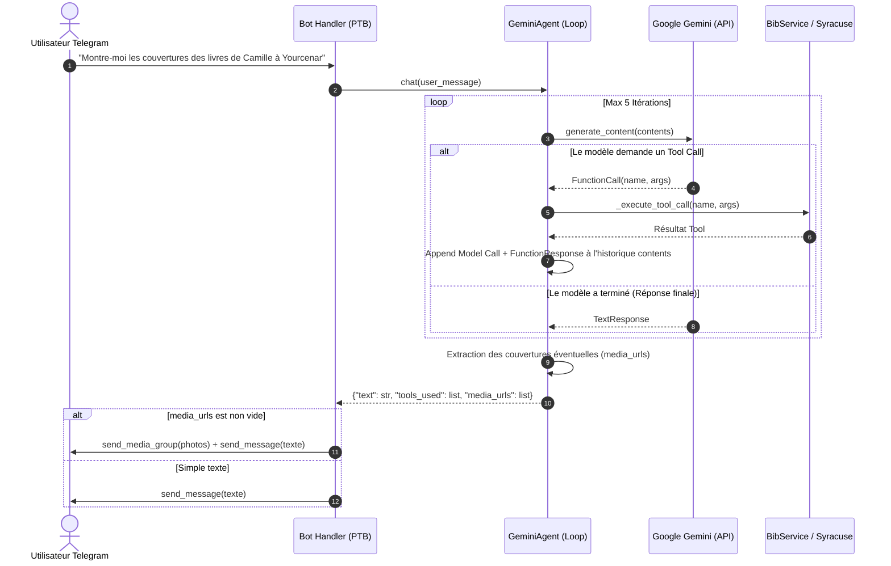

# Spécification Technique : Agent Gemini Itératif & Multi-Modal (BiblioBot)

## 1. Contexte & Objectifs

Actuellement, l'agent conversationnel dans `src/ai/gemini_agent.py` fonctionne en **single-turn function calling** :
1. L'utilisateur envoie une requête.
2. Gemini appelle éventuellement un ou plusieurs outils en parallèle.
3. Les résultats sont renvoyés à Gemini pour générer le texte final.

### Limitation actuelle
Si une requête nécessite un **raisonnement multi-étapes séquentiel** (par exemple : *"Montre-moi la couverture de tous les livres que Camille doit rendre cette semaine à Yourcenar"*), l'agent ne peut pas :
- **Étape 1** : Appeler `get_loans(user_name='Camille', branch_name='Yourcenar', due_within_days=7)` pour récupérer la liste des livres filtrés et leurs identifiants (`loan_id`).
- **Étape 2** : Analyser la liste obtenue, constater qu'il a besoin des couvertures visuelles de ces identifiants précis, puis appeler `get_book_covers(loan_ids=[...])`.
- **Étape 3** : Synthétiser la réponse textuelle ET retourner les images pour que Telegram affiche un album photo (`MediaGroup`).

### Objectifs
1. **Boucle de Function Calling itérative (Multi-Turn ReAct)** : Permettre jusqu'à $N$ itérations (ex: `max_turns = 5`) où Gemini peut enchaîner appels d'outils et observations jusqu'à satisfaction de la requête.
2. **Support des réponses enrichies (Texte + Médias)** : Renvoyer un dictionnaire structuré contenant le texte de réponse et une liste optionnelle de `media_urls` (images / couvertures).
3. **Restitution Telegram native** : Dans `src/bot/handlers.py`, si des `media_urls` sont retournées, envoyer un `send_media_group` d'images accompagnant le message texte.
4. **Schéma d'outils optimisé** : Adapter `get_book_covers` pour accepter optionnellement une liste `loan_ids: list[str]`.

---

## 2. Architecture & Flux d'Exécution



---

## 3. Détails d'Implémentation

### 3.1. Évolution du schéma d'outils (`src/ai/tools_schema.py`)
Mise à jour de `get_book_covers` pour permettre un filtrage précis par identifiants d'emprunts :
```python
{
    "name": "get_book_covers",
    "description": "Récupère les URLs et couvertures visuelles des livres en cours d'emprunt.",
    "parameters": {
        "type": "OBJECT",
        "properties": {
            "user_name": {"type": "STRING", "description": "Nom du membre (optionnel)."},
            "loan_ids": {
                "type": "ARRAY",
                "items": {"type": "STRING"},
                "description": "Liste précise d'identifiants de prêts pour lesquels récupérer la couverture (optionnel).",
            },
        },
    },
}
```

### 3.2. Refonte de `GeminiAgent.chat()` (`src/ai/gemini_agent.py`)
- **Historique `contents` dynamique** : initialisé avec `user_message`.
- **Boucle `while turn < max_turns` (défaut : 5)** :
  - Appel `self._client.models.generate_content(...)`.
  - Si `response.function_calls` est vide : fin de boucle, retour du texte final.
  - Si `response.function_calls` est présent :
    - On ajoute `response.candidates[0].content` à `contents`.
    - Pour chaque `call` : exécution via `_execute_tool_call(call.name, call.args)`.
    - Si l'outil est `get_book_covers`, on mémorise les `cover_url` valides dans une liste `collected_media_urls`.
    - Création du `Part.from_function_response(...)`.
    - Ajout des parts de réponse à `contents` sous `role="user"`.
- **Résultat de `chat()`** :
  ```python
  return {
      "text": final_text,
      "tools_used": tools_executed,
      "media_urls": collected_media_urls[:10], # Limite Telegram de 10 médias par album
  }
  ```

### 3.3. Intégration Telegram (`src/bot/handlers.py`)
Dans `text_message_handler` :
- Appel `res = await self.gemini_agent.chat(user_text)`.
- Si `res.get("media_urls")` :
  - Construction d'un `media_group = [InputMediaPhoto(media=url) for url in media_urls]`.
  - Appel `await context.bot.send_media_group(chat_id=chat_id, media=media_group)`.
- Envoi du message explicatif / synthétique avec `_send_or_edit(...)`.

---

## 4. Stratégie de Test & Robustesse
1. **Tests unitaires `test_gemini_tools.py`** :
   - Tester l'exécution itérative simulée (Mock de `generate_content` en 2 tours : tour 1 -> ToolCall, tour 2 -> TextResponse).
   - Tester l'arrêt au bout de `max_turns` si le modèle boucle.
   - Tester la collecte des `media_urls`.
2. **Gestion des erreurs & Timeout** :
   - Timeout global conservé à l'échelle de la requête webhook.
   - Si une exception survient pendant un tool call, renvoyer `{"error": ...}` au modèle pour qu'il puisse adapter sa réponse plutôt que de planter le bot.
