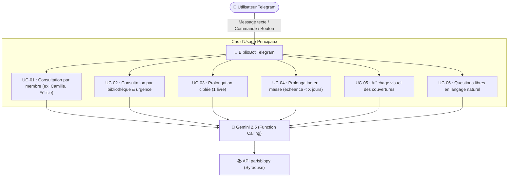

# 📖 Spécification Fonctionnelle & Cas d'Usage — BiblioBot Paris

> **Document de référence** : Définition des parcours utilisateurs, interactions Telegram et règles métier pour l'assistant intelligent de gestion des emprunts des bibliothèques de la Ville de Paris.

---

## 1. Vision du Produit & Objectifs

**BiblioBot Paris** est un assistant conversationnel Telegram personnel et familial, propulsé par l'IA **Google Gemini** et connecté au portail Syracuse des **Bibliothèques de la Ville de Paris** via la bibliothèque Python [`parisbibpy`](https://github.com/botalla/parisbibpy).

### Objectifs principaux :
- **Zéro retard d'emprunt** : Visibilité immédiate des livres à rendre, alertes proactives et prolongation en un clic.
- **Expérience multi-comptes / Famille fluide** : Gestion unifiée des cartes d'emprunteurs associées (ex: carte personnelle, carte de Camille, etc.) sans jongler entre plusieurs comptes.
- **Compréhension en langage naturel** : Capacité à converser naturellement sur mobile (ex: *"Qu'est-ce qu'on doit rendre aujourd'hui ?"*, *"Prolonge tout ce qui expire bientôt"*).
- **Expérience visuelle riche** : Affichage des couvertures de livres pour identifier en un coup d'œil les ouvrages éparpillés dans la maison.
- **Optimisation des trajets (Trip Planner)** : Organisation des retours par bibliothèque de prêt pour préparer son sac efficacement.

---

## 2. Acteurs & Personas

| Acteur | Description | Canal d'accès |
| :--- | :--- | :--- |
| **Utilisateur Principal / Famille** | Titulaire(s) des comptes Telegram autorisés (sécurisés par `chat_id` / `user_id` whitelistés). | Application mobile / desktop Telegram |
| **Profils Cartes Emprunteurs** | Comptes usagers de la Ville de Paris gérés par `parisbibpy` (Compte principal + cartes associées `UserPairings`, ex: *Camille*). | Données internes Syracuse |
| **BiblioBot (IA Gemini)** | Agent autonome orchestrant la compréhension du langage naturel, l'appel aux outils `parisbibpy`, et la restitution formatée. | Service Cloud Run |

---

## 3. Matrice des Cas d'Usage



---

## 4. Description Détaillée des Cas d'Usage

### UC-01 : Consultation des emprunts par membre de la famille

- **Intention utilisateur** : Connaître les livres empruntés par une personne spécifique rattachée au compte (ex: *"liste tous les emprunts de Camille"*, *"qu'a emprunté Félicie ?"*, ou commande `/membre Félicie`).
- **Déclencheur** : Message en langage naturel, commande `/membre [nom]` ou sélection via bouton menu `[👨‍👩‍👧 Emprunts par membre]`.
- **Flux d'exécution** :
  1. L'utilisateur envoie son message ou tape `/membre Félicie` (si tapé seul `/membre`, le bot renvoie des boutons inline avec chaque membre détecté via `parisbibpy`).
  2. L'IA Gemini (ou le routeur de commande) extrait le filtre : `account_name = "Félicie"` (ou tout autre membre présent sur le compte).
  3. L'outil `get_loans(user_filter=...)` interroge la couche famille de `parisbibpy`.
  4. Le bot renvoie la liste claire et formatée sous forme de message Telegram avec boutons d'actions contextuels.
- **Exemple de rendu Telegram** :
  ```text
  📚 Emprunts de Camille (3 ouvrages) :

  1. 📖 Mortelle Adèle - Tome 12
     🏛️ Médiathèque Marguerite Duras
     ⏳ À rendre pour le : 05/10/2026 (dans 2 jours)
     🔄 Prolongé : 0/2 fois

  2. 📖 L'Arabe du futur - Vol. 4
     🏛️ Médiathèque Marguerite Duras
     ⏳ À rendre pour le : 18/10/2026 (dans 15 jours)

  3. 🎲 Catan Junior (Jeu)
     🏛️ Bibliothèque Václav Havel
     ⏳ À rendre pour le : 22/10/2026 (dans 19 jours)
  ```
- **Boutons Inline attachés** :
  `[🔄 Prolonger Mortelle Adèle]` `[🖼️ Voir les couvertures]`

---

### UC-02 : Consultation par bibliothèque et échéance (Trip Planner)

- **Intention utilisateur** : Savoir quels livres doivent être rapportés à une bibliothèque spécifique aujourd'hui ou dans les prochains jours (ex: *"quels sont les livres à rendre aujourd'hui dans cette bibliothèque ?"*, *"je vais à Marguerite Duras, qu'est-ce que je dois rendre ?"*).
- **Déclencheur** : Message texte ou géolocalisation / sélection de médiathèque.
- **Flux d'exécution** :
  1. L'utilisateur demande : *"Quels sont les livres à rendre aujourd'hui à la médiathèque Marguerite Duras ?"*.
  2. Gemini identifie la bibliothèque cible et la fenêtre temporelle (`due_date <= aujourd'hui`).
  3. `parisbibpy` utilise son **Trip Prioritization Planner** pour filtrer par branche et trier par urgence de retour.
  4. Réponse synthétique avec indicateurs visuels d'urgence (🔴 Aujourd'hui / En retard, 🟠 < 3 jours, 🟢 Confortable).
- **Exemple de rendu Telegram** :
  ```text
  🎒 Sac de retour pour : Médiathèque Marguerite Duras (2 livres)

  🔴 URGENT — À rendre aujourd'hui :
  • "Le problème à 3 corps" — Liu Cixin (Carte : Jean)
  • "Petit Pays" — Gaël Faye (Carte : Camille)

  💡 Conseil : Si vous ne pouvez pas passer aujourd'hui, vous pouvez les prolonger directement ci-dessous !
  ```
- **Boutons Inline attachés** :
  `[🔄 Prolonger les 2 livres]` `[🗺️ Horaires & Adresse]`

---

### UC-03 : Prolongation ciblée d'un livre

- **Intention utilisateur** : Prolonger un ouvrage précis sans devoir aller sur le site web (ex: *"prolonge ce livre"*, *"prolonge Le problème à 3 corps"* ou clic sur un bouton inline).
- **Déclencheur** :
  - Clic sur le bouton `[🔄 Prolonger]` présent sous un livre.
  - Commande texte : *"prolonge Mortelle Adèle"*.
- **Flux d'exécution** :
  1. Si commande texte : Gemini résout l'identifiant du prêt correspondant au titre parmi les emprunts actifs.
  2. Si bouton : la commande transmet directement le `loan_id` via le `callback_data`.
  3. Appel de `parisbibpy.renew_loan(loan_id)`.
  4. Analyse du retour Syracuse :
     - **Succès** : Nouvelle date d'échéance confirmée.
     - **Refus / Blocage** : Message explicatif (quota max de 2 prolongations atteint, document réservé par un autre adhérent, carte expirée).
- **Exemple de rendu Telegram** :
  ```text
  ✅ Prolongation réussie !
  📖 "Le problème à 3 corps"
  📅 Nouvelle date de retour : 24/10/2026 (+21 jours)
  ```

---

### UC-04 : Prolongation en masse conditionnelle

- **Intention utilisateur** : Sécuriser tous les prêts de la famille qui arrivent à expiration sans intervention manuelle livre par livre (ex: *"prolonge tout ce qui expire dans moins de 5 jours"*, *"prolonge tout ce qui est urgent"*).
- **Déclencheur** : Message en langage naturel ou commande `/renew_expiring [jours]`.
- **Flux d'exécution** :
  1. Gemini extrait le seuil de jours (ex: `days = 5`, défaut `3` si non précisé).
  2. Recherche de tous les emprunts multi-cartes dont la date d'échéance $\le \text{date\_actuelle} + X\text{ jours}$.
  3. Exécution du renouvellement par lot via `parisbibpy.batch_renew()`.
  4. Restitution du rapport de renouvellement (`RenewalReport`) structuré.
- **Exemple de rendu Telegram** :
  ```text
  ⚡ Rapport de prolongation automatique (< 5 jours) :

  ✅ 3 livres prolongés avec succès :
  • "Le problème à 3 corps" (Jean) ➜ Nouveau terme : 24/10/2026
  • "Mortelle Adèle T12" (Camille) ➜ Nouveau terme : 26/10/2026
  • "Astérix chez les Pictes" (Camille) ➜ Nouveau terme : 26/10/2026

  ⚠️ 1 livre non prolongeable :
  • "Les Misérables" (Jean) ➜ ❌ Déjà prolongé le nombre maximum de fois (2/2). À rapporter avant demain !
  ```

---

### UC-05 : Affichage visuel des couvertures (Book Covers)

- **Intention utilisateur** : Retrouver visuellement les livres dans la maison grâce à leur couverture (ex: *"affiche les couvertures des livres à rendre"*, *"à quoi ressemblent les livres de Camille ?"*).
- **Déclencheur** : Message texte ou bouton `[🖼️ Afficher les couvertures]`.
- **Flux d'exécution** :
  1. `parisbibpy` extrait les URLs des couvertures (vignettes Syracuse, Electre, BNF ou OpenLibrary).
  2. L'application Telegram Bot regroupe les images dans un groupe média (`send_media_group`) ou génère un carrousel / message photo avec légende détaillée.
  3. Légende sous chaque photo : Titre, Emprunteur, Date d'échéance.
- **Exemple de rendu Telegram** :
  - Envoi d'un album photo (jusqu'à 10 photos par groupe média).
  - Chaque photo comporte sa légende : `📖 "Mortelle Adèle T12" (Camille) - À rendre le 05/10/2026`.

---

### UC-06 : Questions libres et requêtes ouvertes en langage naturel

- **Intention utilisateur** : Poser n'importe quelle question sur l'état de son compte de bibliothèque sans syntaxe rigide.
- **Exemples de questions supportées** :
  - *"Est-ce qu'on a des retards ?"*
  - *"Combien de livres on a en tout sur toutes les cartes ?"*
  - *"Rappelle-moi dans quelle bibliothèque on a pris la bande dessinée bleue ?"*
  - *"Est-ce que Camille peut encore emprunter des livres ?"*
- **Flux d'exécution** :
  1. Gemini reçoit le prompt utilisateur + la liste des outils (Function Calling).
  2. Gemini décide d'appeler les fonctions nécessaires (ex: `get_all_loans()`, `get_account_status()`).
  3. L'agent interprète le résultat JSON et rédige une réponse bienveillante, concise et prête pour mobile.

---

> [!NOTE]
> **Rappels quotidiens programmés** : Les alertes et notifications proactives du matin sont couvertes par un service autonome dédié (ex: agent planifié indépendant). Ce bot Telegram se concentre sur l'interaction interactive à la demande (Pull).

---

## 5. Synthèse des Commandes Telegram (Menu BotFather)

Pour les utilisateurs préférant les raccourcis aux phrases en langage naturel :

| Commande | Rôle |
| :--- | :--- |
| `/start` | Accueil, statut du bot et affichage du menu principal interactif |
| `/emprunts` | Vue globale synthétique de tous les emprunts de la famille |
| `/urgences` | Liste des livres à rendre dans les 48 heures |
| `/membre [nom]` | Affiche les emprunts d'un membre (ex: `/membre Félicie`, `/membre Camille`). Si tapé seul (`/membre`), propose des boutons avec la liste des membres trouvés sur le compte |
| `/prolonger` | Menu interactif de prolongation |
| `/couvertures` | Envoi des couvertures des livres en cours d'emprunt |
| `/aide` | Exemples de phrases en langage naturel compréhensibles par le bot |

---

## 6. Exigences Non Fonctionnelles

1. **Latence** : Réponse aux requêtes simples en moins de 2,5 secondes (mise en cache des sessions Syracuse pour éviter le re-login systématique).
2. **Confidentialité & Sécurité** :
   - Filtrage strict des accès : Seuls les identifiants Telegram (Chat IDs) autorisés dans le fichier d'environnement peuvent interagir avec le bot.
   - Les identifiants de la bibliothèque (numéro de carte, mot de passe) sont stockés dans **GCP Secret Manager**.
3. **Robustesse réseau** : Gestion des pannes temporaires du portail Syracuse avec message d'attente amical au lieu d'un crash technique.
